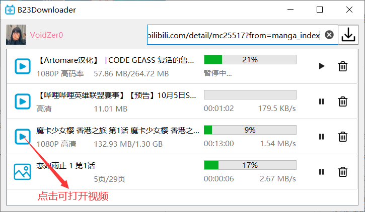
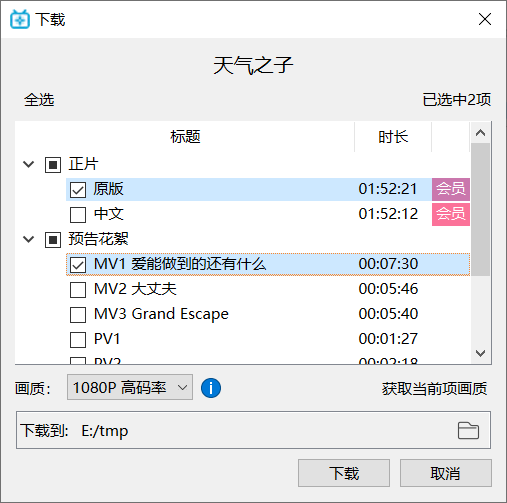
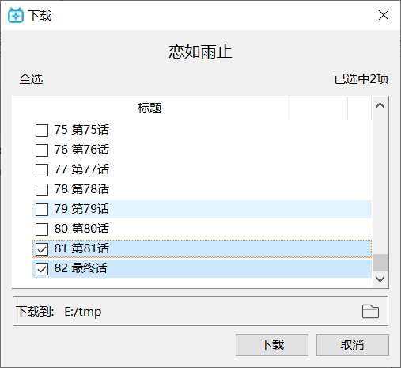
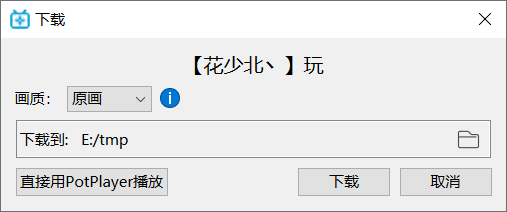

<h1 align="center">
   
  
   
  B23Downloader
   
</h1>

B23Downloader: 下载B站 视频/直播/漫画

+ 下载链接：[GitHub](https://github.com/vooidzero/B23Downloader/releases) ／ [南大Git](https://git.nju.edu.cn/zero/B23Downloader/-/releases)

+ [使用说明](#使用说明)

+ [Build-Issues](#Build-Issues)

+ [开发日志](#开发日志)

# 使用说明

## Main Window

简单，但也够用了。没有历史记录功能。（当然，对于正在下载的任务，关闭程序后再打开还是在的）

## 下载位置

### 视频类

在上图中，选择的下载位置为 **E:/tmp**，那么选中的两个视频分别下载到 **E:/tmp/天气之子 原版.flv** 和 **E:/tmp/天气之子 预告花絮 MV1 爱能做到的还有什么.flv**

### 漫画

如上图，下载位置还是 **E:/tmp**，选中的两项分别下载到文件夹 **E:/tmp/恋如雨止 81 第81话/** 和 **E:/tmp/恋如雨止 82 最终话/**.

漫画是一页一页下载的，在该示例中，*82 最终话* 将下载为 **E:/tmp/恋如雨止 82 最终话/01.jpg - 32.jpg**（32 张图片）。

> 目前删除漫画下载任务会粗暴地删除整个文件夹，如示例中的 E:/tmp/82 最终话/

### 直播

上图中，首先注意到，对话框中的标题为 【花少北丶】玩，其命名规则为【<用户名>】<房间标题>。

下载文件的命名为 <标题> <下载开始时间>.flv，比如**【花少北丶】玩 [2021.09.24] 22.21.45.flv**，其所在文件为上图中所选的 **E:/tmp/**

目前的直播下载任务策略为：

- 暂停直播下载任务后重新开始，会写入另一个文件，比如 【花少北丶】玩 [2021.09.24] **22.32.11**.flv
- 删除任务不会删除任何相关文件
- 任务不会被保存，即退出程序后再启动，之前的直播下载任务不被保留

> 如果添加直播下载任务时，正在下载的任务数量超过最大可同时下载任务数（代码里硬编码为 3），那么这个直播下载任务会处于“等待下载”状态。

## 支持的 URL 输入

- 用户投稿类视频链接*（注：不支持互动视频）*
- 剧集（番剧，电影等）链接*（注：暂不支持活动页链接如[「天气之子」B站正在热播！](https://www.bilibili.com/blackboard/topic/activity-jjR1nNRUF.html)）*
- 课程类视频链接
- 直播链接
- 直播活动页链接，如 [Aimer线上演唱会 "Walpurgis"](https://live.bilibili.com/blackboard/activity-Aimer0501pc.html)
- 漫画链接*（注：暂不支持 Vomic）*
- b23.tv 视频短链，b22.top 漫画短链

部分类型可以使用编号：

- 视频 BV 或 av 号，如 ***BV1ab411c7St*** 或 ***av35581924***
- 剧集 ssid 或 epid，如 ***ss28341*** 或 ***ep281280***
- live+直播房间号，如 ***live6***

## 网络代理

暂未实现“设置”功能（以后有时间会加上的），代理跟随系统，你可以设置全局代理来下载地域限制内容（比如代理服务器在香港，那么可以下载“仅限港澳台地区”的动漫）。

# Build-Issues
B23Downloader 使用 Qt 6 (C++ 17) 开发。

由于所有请求链接均采用 HTTPS，所以依赖 OpenSSL库。虽然 Qt Installer 可以勾选  OpenSSL Toolkit，但 Qt Installer 并不会设置好相关环境，于是会出现找不到 SSL 库的错误（如 TLS initialization failed），解决方法参考 [TLS initialization failed on GET Request - Stack Overflow](https://stackoverflow.com/questions/53805704/tls-initialization-failed-on-get-request/59072649#59072649).

# 开发日志

### 为什么想做这个东西？

最开始是 Aimer 2020.11.27 的线上演唱会，想要直接下载直播流（而不是有二次编码的录屏），于是在网上找到了获取 B 站直播流 URL 的 API，用 python 来完成请求；不过当时不知道要设置 http 头部 referer 和 user-agent，用 ffmpeg 提示 403 错误……

2021 年 1 月，类似地，我简单地写了个 python 脚本来下载电影。

2021 年 4 月底，Aimer 又要开线上演唱会了（5 月 1 日）。此前 cookie 都是从浏览器里复制然后硬编码在代码里的，这时我想能不能做个图形界面来完成登录保存 cookie，于是写了个 pyqt 程序来实现这一想法，功能也只有直播下载这一项（python 请求到直播流 URL 后丢给 [ffmpeg](https://ffmpeg.org/) 下载）。

2021 年 6 月底，我想做一个功能更完善的图形界面程序。当然，如果已经有满足需求的工具存在，那我再写一个就完全没有意义。

- CLI 程序里，[You-Get](https://github.com/soimort/you-get) 很好，支持包括 B 站在内的各种视频网站，但毕竟是 CLI
- 在直播方面，[B站录播姬](https://rec.danmuji.org/) 做得不错，但是没有登录功能也就没法下载付费直播
- 浏览器扩展插件里，[Bilibili Helper](https://bilibilihelper.com/) 还可以，但是一部番剧如果我想把几十集甚至上百集全下下来的话，只能一个视频一个视频地去下载。

于是有了 B23Downloader 这个坑，同时语言也改用 C++。

>  最后感谢 [SocialSisterYi/bilibili-API-collect: 哔哩哔哩-API收集整理](https://github.com/SocialSisterYi/bilibili-API-collect)，虽然 B23Downloader 里用的 API 有很大一部分是我自己后面找的。以后有时间也为这个仓库贡献一下。

